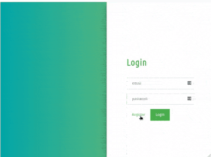

# Thapar Login UI 🔒
Welcome to the Thapar Login UI, a modern and responsive login/registration interface designed for the Thapar community.

## Features ✨
The Thapar Login UI comes packed with the following features:
- Sleek and minimalist design
- Smooth slide animation to switch between login and registration forms
- Responsive layout for seamless experience on various devices

## Getting Started 🚀
To run the Thapar Login UI locally, follow these steps:

1. Clone the repository: git clone https://github.com/your-username/thapar-login-ui.git
2. Navigate to the project directory:cd thapar-login-ui
3. Open the `index.html` file in your preferred web browser.

## Usage 📖
The Thapar Login UI allows users to switch between the login and registration forms with a smooth slide animation. Let's take a closer look at how it works:

  

1. To switch to the registration form, click the "Register" button on the right side.
2. To switch back to the login form, click the "Login" button on the left side.

Both the login and registration forms include input fields for email and password, allowing users to enter their credentials and access the desired functionality.

## Technologies Used 🛠️
The Thapar Login UI is built using the following technologies:
- **HTML**: Providing the structure and markup for the web pages.
- **CSS**: Styling the UI elements and creating the responsive layout.
- **JavaScript**: Powering the smooth slide animation between the login and registration forms.
- **jQuery**: Simplifying DOM manipulation and event handling.

## Contributing 🤝
Contributions are welcome! If you find any issues or have suggestions for improvement, please feel free to open an issue or submit a pull request. Your input can help make the Thapar Login UI even better.

## License 📄
This project is licensed under the [MIT License](LICENSE), which means you're free to use, modify, and distribute the code as long as you include the original copyright and license notices.
